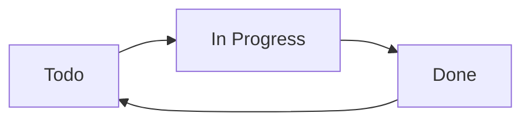
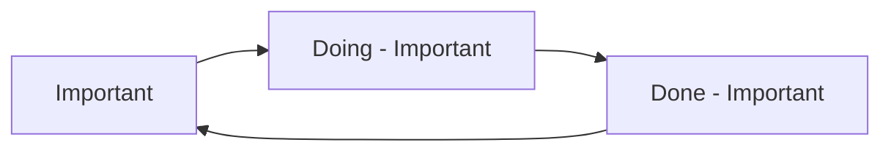
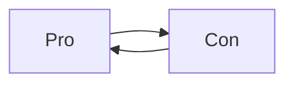
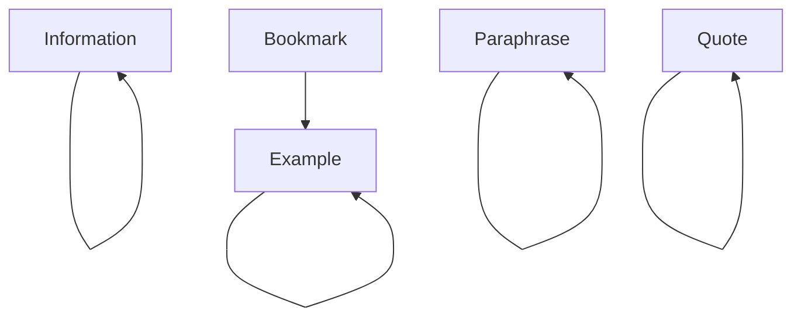

# 예시 상태

## 개요

[[Statuses]]가 무엇인지 알았으니, 이를 활용하여 어떤 일을 할 수 있을까요?

다음은 영감을 얻기 위한 몇 가지 예시 시나리오입니다.

## Todo -> In Progress -> Done

Tasks의 `Todo` 상태를 조정하여 'In Progress'로 전환되고, 그 다음에 'Done'으로 전환되도록 설정할 수 있습니다.

이는 시간이 조금 더 걸리는 몇 가지 작업에 주목할 필요가 있는 경우 유용할 수 있습니다. 현재 진행 중인 작업을 완료하기 전에 새로운 작업을 시작하기보다는 진행 중인 작업을 우선적으로 마무리하는 것이 좋을 수도 있습니다.

<!-- placeholder to force blank line before included text --><!-- include: DocsSamplesForStatuses.test.DefaultStatuses_todo-in_progress-done.approved.md -->

| 상태 기호 | 다음 상태 기호 | 상태 이름 | 상태 유형 | 사용자 지정 스타일 필요 |
| ----- | ----- | ----- | ----- | ----- |
| `space` | `/` | Todo (할 일) 	| `TODO` 	| 아니요 |
| `/` 	| `x` 	| In Progress (진행 중) 	| `IN_PROGRESS` 	| 예 |
| `x` 	| `space` 	| Done (완료) 	| `DONE` 	| 아니요 |

<!-- placeholder to force blank line after included text --><!-- endInclude -->

## 중요한 작업을 위한 별도의 사이클

가끔 몇 가지 정말 중요한 작업이 있고, 여러 테마에서 `!`로 표시된 작업이 시각적으로 돋보이기 때문에 이것이 아주 잘 작동한다는 것을 알게 되었습니다.

`IN_PROGRESS`와 `DONE` 상태에 표준이 아닌 기호를 사용하여, 나중에 완료된 작업을 다시 열기로 결정할 경우 자동으로 다시 `!`로 전환됩니다.

<!-- placeholder to force blank line before included text --><!-- include: DocsSamplesForStatuses.test.DefaultStatuses_important-cycle.approved.md -->

| 상태 기호 | 다음 상태 기호 | 상태 이름 | 상태 유형 | 사용자 지정 스타일 필요 |
| ----- | ----- | ----- | ----- | ----- |
| `!` 		| `D` 		| Important (중요) 			| `TODO` 			| 예 |
| `D` 		| `X` 		| Doing - Important (진행 중인 중요) 		| `IN_PROGRESS` 	| 예 |
| `X` 		| `!` 		| Done - Important (완료된 중요) 			| `DONE` 			| 예 |

<!-- placeholder to force blank line after included text --><!-- endInclude -->

## Pro와 Con 체크박스 - 서로 토글

막혔을 때 아이디어를 떠올리기 위해 Pro와 Con 목록을 작성하는 경우가 있습니다.

다행히도 일부 테마에서는 이를 위해 `P`와 `C`를 사용합니다. 다른 테마에서는 `p`와 `c`를 사용하기도 합니다.

어느 방식이든 상관없이 이들을 서로 토글할 수 있으며, 이들에게 `NON_TASK` 유형을 부여하여 작업 검색에서 제외시킬 수 있습니다. 왜냐하면 이러한 작업은 실행 가능한 작업으로 보지 않기 때문입니다.

<!-- placeholder to force blank line before included text --><!-- include: DocsSamplesForStatuses.test.DefaultStatuses_pro-con-cycle.approved.md -->

| 상태 기호 | 다음 상태 기호 | 상태 이름 | 상태 유형 | 사용자 지정 스타일 필요 |
| ----- | ----- | ----- | ----- | ----- |
| `P` 	| `C` 	| Pro (장점) 	| `NON_TASK` 	| 예 |
| `C` 	| `P` 	| Con (단점) 	| `NON_TASK` 	| 예 |

<!-- placeholder to force blank line after included text --><!-- endInclude -->

## 클릭 및 토글 무시

실제로는 작업에 사용되지 않고 순전히 표시 목적으로 사용되는 상태가 있는 경우, 이러한 상태를 실수로 클릭하더라도 토글되거나 완료 날짜가 부여되지 않도록 하고 싶을 수 있습니다.

같은 상태 기호와 다음 상태 기호를 가진 상태들이며, `DONE`이 아닌 유형을 가지고 있는 경우에는 토글될 때 아무런 동작도 수행하지 않습니다.

다음은 ITS 테마에서 이러한 동작이 유용할 수 있는 몇 가지 상태입니다.

<!-- placeholder to force blank line before included text --><!-- include: DocsSamplesForStatuses.test.DefaultStatuses_toggle-does-nothing.approved.md -->

| 상태 기호 | 다음 상태 기호 | 상태명 | 상태 타입 | 사용자 지정 스타일 필요 여부 |
| ----- | ----- | ----- | ----- | ----- |
| `b` | `b` | Bookmark(북마크) | `NON_TASK` | Yes |
| `E` | `E` | Example(예시) | `NON_TASK` | Yes |
| `I` | `I` | Information(정보) | `NON_TASK` | Yes |
| `P` | `P` | Paraphrase(요약본) | `NON_TASK` | Yes |
| `Q` | `Q` | Quote(인용) | `NON_TASK` | Yes |

<!-- placeholder to force blank line after included text --><!-- endInclude -->
