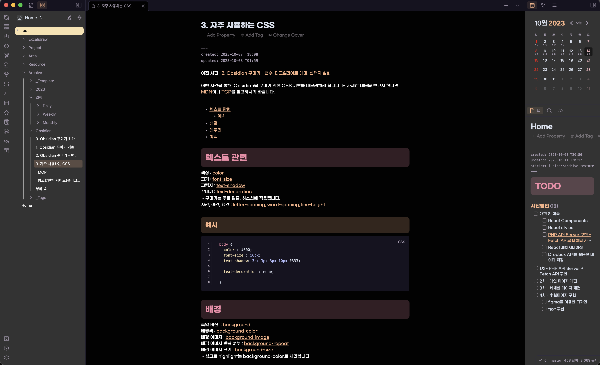
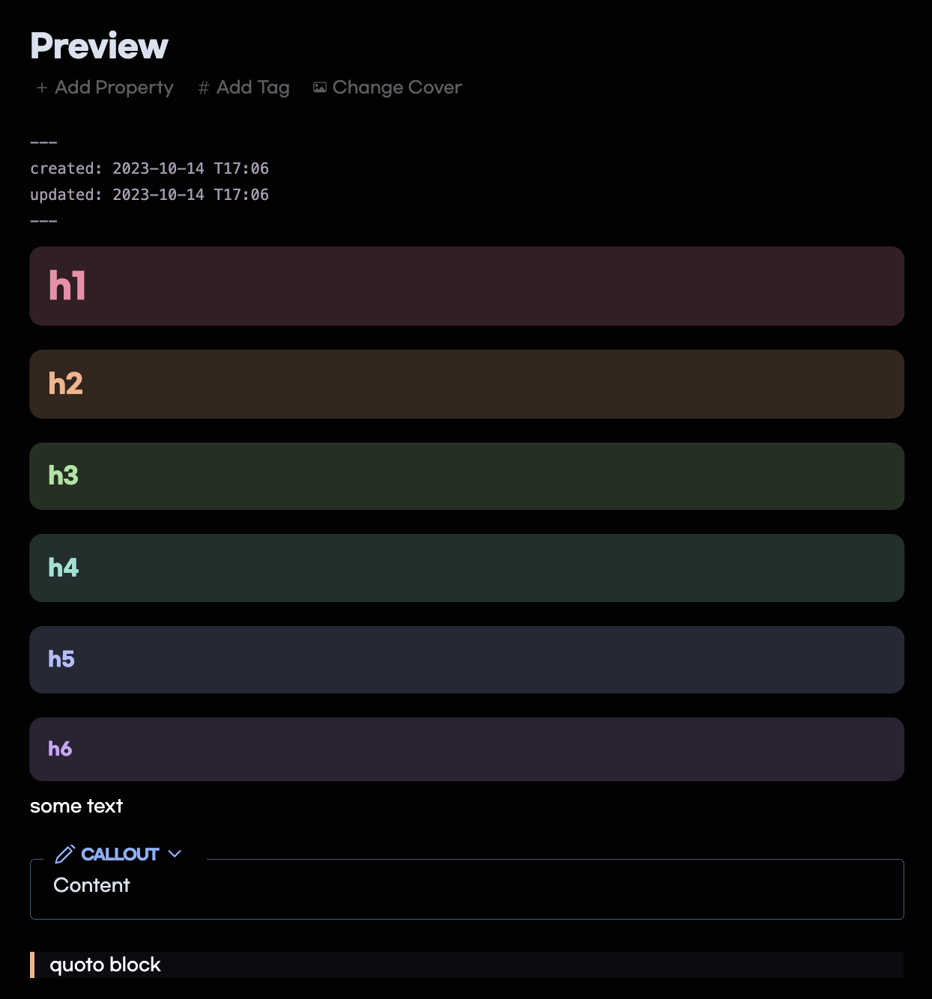

[영어](./readme.md)

# 이것은 저의 Obsidian 설정입니다.

## 미리보기

## 제가 사용하는 플러그인

- Automatic Table Of Contents
- Calendar
- Code Editor Shortcut
- Code Emitter
- CSS Editor
- Dataview
- Homepage
- MAKE.md
- Obsidian Git
- Obsidian shared to Notion
- Paste URL into Selection
- Style Settings
- Tag Page
- Tasks
- Templater
- Typewriter Mode
- Ultimate Todoist Sync
- Update tiem on edit

## 제가 쓰는 테마

- AnuPpuccin

## CSS Snippets 설명

저는 다크테마를 기준으로만 보았기에, 라이트 테마를 쓰시는 분들에겐 맞지 않을 수 있습니다.

1. 다크 테마 기준으로 메인 배경색(편집기)는 검정으로, 글자는 흰색으로 바꿨습니다.
2. MAKE.md의 폴더 아이콘을 지우고 파일명은 흰색으로 나오게 설정했습니다.
3. dataview에서 Task 여백을 조절하고 하위 Task가 구분되게 설정했습니다.
4. dataview에서 list 형태로 출력되는 것은 2줄까지만 출력되게 했습니다. 또한 Ultimate todoist sync에서 추가되는 #todoist와 link 태그는 보이지 않게 설정했습니다.
5. Callout은 minimal 테마의 callout-outline을 가져왔습니다.
6. Calendar에서 토요일은 분홍색, 일요일은 붉은색으로 표기되게 했습니다. 또한 오늘 날짜는 반투명한 검정 배경으로 바꿈으로 구분감이 있게 했습니다.

- 이 부분은 여러분이 첫 주의 시작 요일 설정과 Show week number를 표기하게끔 했는지에 따라 다릅니다.
- Show week number를 표기하게 했다면, calendar-plugin.css에서 td:nth-child(7), td:nth-child(1) 중에서 괄호 안의 숫자를 1씩 증가시켜주시기 바랍니다.

7. heading color는 AnuPpuccin에서 가져왔습니다. 각 Heading의 위계에 설정된 색상의 alpha값이 추가된 것을 배경색으로 지정했습니다. 또한 border를 이용하여 위 아래 여백을 추가했습니다.
8. quoto의 왼쪽 라인을 두껍게 설정했습니다.
9. 하이라이트 색상을 약간 붉은빛이 돌게 설정했습니다.
10. 체크박스에서 p와 r은 특정 이모지가 나오게 설정했습니다.

그 외 궁금한 사항이나 추가 요청사항은 issue로 올려주시면 확인하는대로, 그리고 할 수 있는 선에서 최대한 도와드리도록 하겠습니다.
